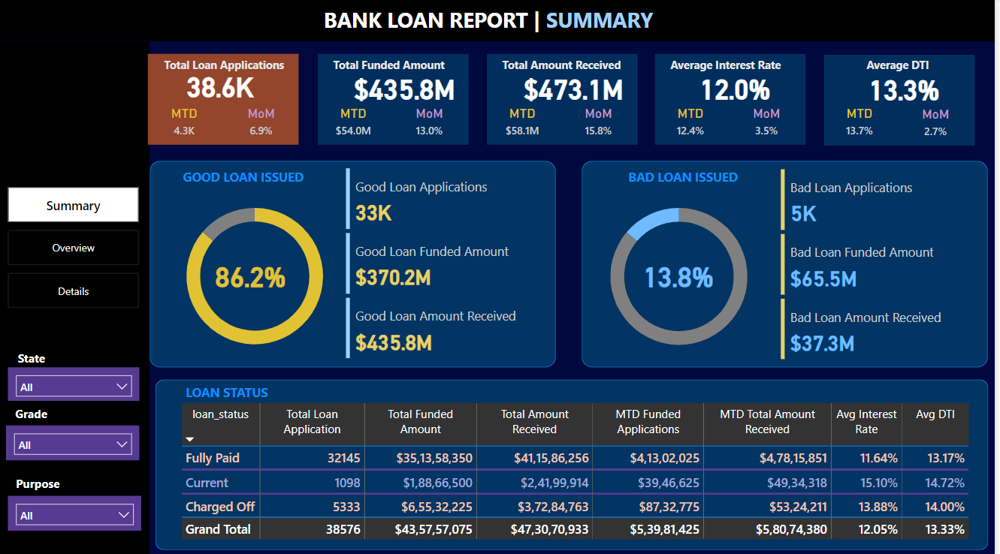
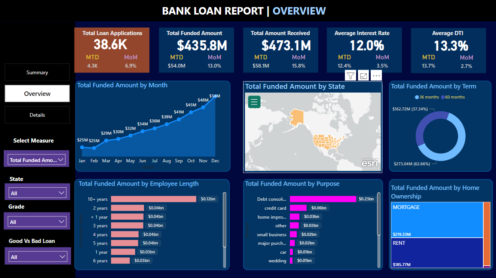
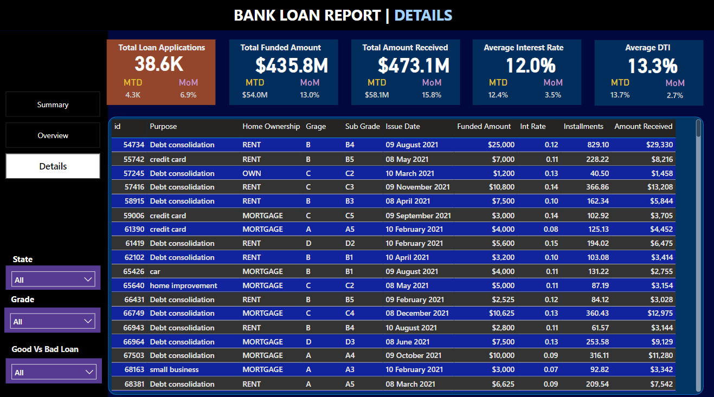

# Syntecxhub_bank_loan_Analysis
# # 🏦 Bank Loan Analysis | Power BI

## 📌 Project Overview

The **Bank Loan Analysis** project is an interactive Power BI dashboard developed to analyze bank loan applications, funded amounts, repayments, and overall loan performance.

The dashboard provides business insights into **loan trends, customer behavior, loan purposes, loan terms, risk classification, and repayment performance**.

---

## 🎯 Project Objectives

* Analyze total bank loan applications
* Calculate total funded and received amounts
* Analyze average interest rate and DTI
* Classify loans into Good Loans and Bad Loans
* Identify monthly loan trends
* Analyze loans by state and purpose
* Analyze loan terms and employment length
* Understand home ownership patterns
* Provide detailed loan-level information
* Create an interactive dashboard for business decision-making

---

## 📊 Key KPIs

| KPI                     |   Value |
| ----------------------- | ------: |
| Total Loan Applications |   38.6K |
| Total Funded Amount     | $435.8M |
| Total Amount Received   | $473.1M |
| Average Interest Rate   |   12.0% |
| Average DTI             |   13.3% |
| Good Loan Applications  |     33K |
| Bad Loan Applications   |      5K |

---

## 📈 Dashboard Pages

### 1. Summary

The Summary page provides a high-level view of the loan portfolio, including:

* Good vs Bad Loan analysis
* Good Loan Applications
* Bad Loan Applications
* Funded Amount
* Amount Received
* Loan Status analysis
* Key performance indicators

### 2. Overview

The Overview page provides visual analysis of:

* Monthly funded amount trends
* State-wise funded amount
* Loan term distribution
* Employment length
* Loan purpose
* Home ownership

### 3. Details

The Details page provides loan-level information including:

* Loan ID
* Purpose
* Home Ownership
* Grade
* Sub Grade
* Issue Date
* Funded Amount
* Interest Rate
* Installments
* Amount Received

Interactive filters are available for **State, Grade, and Good vs Bad Loan**.

---

## 🔍 Key Insights

* Approximately **86.2% of loan applications are classified as Good Loans**.
* Good loans contribute significantly more to the total funded and received amounts.
* **Debt consolidation** is the largest loan purpose by funded amount.
* **60-month loans** account for a larger share of the funded amount compared with 36-month loans.
* Mortgage and rental customers represent major portions of the funded loan portfolio.
* Fully Paid loans represent the largest share of loan applications.

---

## 🛠️ Tools & Technologies

* **Power BI**
* **Power Query**
* **DAX**
* **CSV**
* **Data Visualization**
* **Data Analysis**

---

## 📂 Project Files

* `Bank Loan Analysis.pbix` — Power BI dashboard
* `financial_loan.csv` — Loan dataset
* `Summary.png` — Summary dashboard screenshot
* `Overview.png` — Overview dashboard screenshot
* `Details.png` — Details dashboard screenshot

---

## 📸 Dashboard Preview

### Summary

### Overview

### Details

---

## 💡 Conclusion

This project demonstrates how **Power BI, Power Query, and DAX** can be used to transform raw financial data into an interactive business intelligence dashboard. The analysis helps understand loan performance, customer loan behavior, risk classification, and repayment trends.

---

## 👨‍💻 Author

**Sai Deepak**

**Data Analytics | Power BI | Python | SQL**

